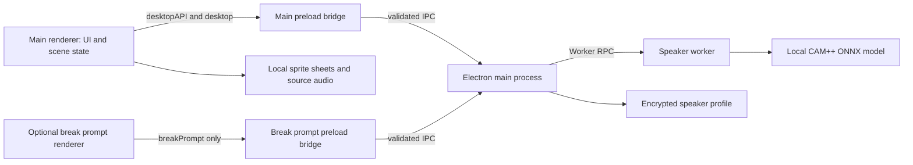
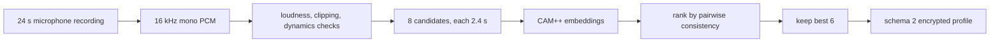
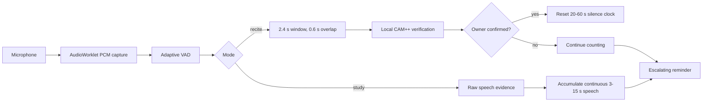

# 凛冬督学局架构

## 目标与边界

“凛冬督学局”是 Windows x64 便携 Electron 应用。背书模式在本机采集麦克风 PCM，先筛选疑似语音活动，再用本地声纹模型验证说话者；只有确认是登记用户时才重置静默计时。自习模式不使用声纹，只判断连续的原始人声证据。

应用不使用摄像头、不保存原始录音、不上传声纹或 PCM，也不依赖网络账号。当前方案不做活体或本人录音防重放。

## 进程与信任边界

- `main.js` 创建一个主 `BrowserWindow`，获得休息券或正在休息时最多再创建一个 420×220 提示窗；它还管理托盘、窗口模式、权限、`rwt://renderer` 协议和声纹服务。
- `preload.js` 只向主页面暴露窗口、声纹和休息提示控制；`break-prompt-preload.js` 只向休息提示页暴露两个提示动作。两个渲染器都没有 Node.js 权限。
- 所有 IPC 都同时核对具体窗口的 `webContents`、主 frame 与精确 `rwt://renderer` URL；两个窗口都拒绝 `window.open`、子 frame 导航和非预期主导航。
- `speaker-service.js` 串行化声纹操作，校验 profile，使用 Electron `safeStorage` 加密并原子写入。
- `speaker-worker.js` 在线程中运行 Sherpa/CAM++，避免推理阻塞渲染与动画。
- `renderer/app.js` 持有双模式会话、VAD、声纹复核、休息流程、窗口模式与动画播放状态。
- `renderer/study-policy.js` 是阈值范围、有效学习时钟、休息/表扬里程碑和自习连续人声判定的唯一事实源。

## 声纹录入

- 唯一合法来源是 `mic`。
- 渲染器先检查 50 ms 能量帧的动态变化；Worker 再执行响度、削波和动态检查。
- 8 个候选按与其他候选的平均余弦相似度排序，保留前 6 个。
- 每个保留向量必须与其余 5 个向量的质心达到 0.50 一致性阈值。
- 档案保存模型哈希、维度、创建时间、阈值和 6 个嵌入，不保存 WAV、PCM 或其他原始录音。
- schema 不是 2、模型哈希/维度不符或文件损坏时 fail closed，并要求重新录入。

## 运行时检测与学习策略

- 启动后先进行约 3 秒环境底噪校准。
- 普通阈值为 0.55，强匹配阈值为 0.70。
- 强匹配一次即可确认；普通匹配要求最近三次判断中至少两次命中。
- 单次失败保持中性复核状态；连续三次明显失败才显示“暂未确认本人声音”。
- 确认状态保持 2.5 秒，验证间隔为 1.2 秒。
- 背书静默阈值由用户在 20～60 秒间选择；阈值到达时若存在正在采集/验证的候选，最多宽限 3 秒。
- 自习持续人声阈值由用户在 3～15 秒间选择，默认 8 秒。策略只累计 VAD 的原始 `speechEvidence`，不累计显示层的 hangover；至少连续安静 1 秒才重新武装，因此键盘等短促瞬态不会累计成违规。
- 程序自己的动画播放期间暂停静默时钟，因此源音轨不会被计为本人背书。

### 待命检测测试

检测面板在会话开始前提供一个独立的 `preflight` 状态。它复用正式 `getUserMedia(audio-only)`、约 3 秒底噪校准、自适应 VAD、自习 `QuietModeDetector`，以及背书模式的本地 CAM++ 声纹验证；滑块修改会实时更新同一份运行设置。因此测试结果与正式学习使用的是同一条判定链路，不另造一套“模拟检测”。

`preflight` 始终保持 `active = false`，并把会话阶段归一为 `idle`。它不启动有效学习时钟、里程碑、巡查调度、动画、源音轨、提醒等级或学习记录。背书测试与正式会话共享最多 3 秒的在途声纹验证宽限；最终达到当前阈值时只在检测面板显示“按当前设置将触发提醒”。背书模式没有本机声纹时拒绝启动测试并引导先录入，避免把普通 VAD 误展示成“本人检测”。

停止测试、开始学习、切换模式、打开声纹录入、手动预览动画、最小化/隐藏窗口、麦克风轨道结束、页面退出或异常时都会走幂等清理，停止 `AudioWorklet`/轮询、关闭 `AudioContext` 并停止全部轨道。这样待命测试不会在后台悄悄占用麦克风，也不会与正式会话叠加第二条音频流。

待命态的开始学习、动画预览、声纹录入与声纹删除使用同步置位的互斥状态。任何操作在第一次异步等待之前先占位并禁用其他入口，等待测试麦克风释放后再次核对状态；因此快速连点不会同时启动两个场景流程、两条麦克风流，或在启动途中修改声纹档案。

主界面常驻音量条和详细音量条上的白色门槛线都操作当前模式的相对灵敏度。渲染位置使用 `latestNoiseFloorDb + sensitivityDb` 转为 -100～0 dB 的绝对位置；还没有采样时用 -50 dB 作为仅供粗调的显示基准。指针拖动会从绝对位置反推相对灵敏度，并按当前模式的 range `min/max/step` 钳制。两个 marker 的位置/ARIA、range、localStorage、VAD 和 `QuietModeDetector` 使用同一设置更新函数。

若自习预检已经达到旧阈值，随后改变持续时间或灵敏度，程序会立即清除旧累计、解除 `QuietModeDetector` 的未武装状态和旧提醒预览，再按新设置重新累计；背书预检也会清除旧结果并从新设置重新判断。

有效学习时钟只在 `studying` 阶段运行；休息、有声事件、开始/恢复、提醒和停止阶段全部暂停。里程碑规则为：

| 模式 | 休息券 | 表扬 |
|---|---|---|
| 背书 | 每 20 分钟 1 张，每张 2 分钟 | 每 45 分钟 |
| 自习 | 每 45 分钟 1 张，每张 2 分钟 | 每 60 分钟 |

休息券在当前会话内累计。休息时释放麦克风并隐藏主窗口；倒计时结束后恢复主窗口，播放一次有声 `E1 → S1 → X1`，重新打开麦克风并校准约 3 秒后才回到 `studying`。

## 场景状态机

`renderer/scene-rules.js` 生成计划，`renderer/app.js` 负责调度和播放。

| 计划 | 顺序 | 自动音轨 |
|---|---|---|
| 开场 | `E1 → S1 → X1` | 三段各自源音轨 |
| 普通巡查 | 随机入场 → 正常观察 → 随机退场 | 静音 |
| 独立事件 | `L_lean` / 红或蓝路过 | 静音 |
| 里程碑表扬 | 随机入场 → `R_pass_react_salute` → 随机退场 | 三段各自源音轨 |
| 第一次违规 | 随机入场 → `R1_react_yell` → 随机退场 | 三段各自源音轨 |
| 第二次违规 | 随机入场 → `R_aim_react_gun` → 随机退场 | 三段各自源音轨 |
| 第三次违规 | 随机入场 → `R_aim_shoot` 或 `R_whip_react_lash` | 两段各自源音轨；结束会话 |
| 手动结束 | `E1 → R_pass_react_salute → X1` | 三段各自源音轨 |

正常计划每 30～120 秒调度一次，25% 为独立事件，75% 为完整巡查。待播放的表扬优先于随机计划。窗口隐藏时普通计划和表扬不会恢复窗口；违规会恢复同一个主窗口并置顶。

`R_fatigue_warning` 与 `X6_exit_abrupt` 不在自动池，只能在媒体库中手动预览。

## 无黑屏媒体播放

- 媒体清单固定为 22 段，均含 1280×720、24 FPS 精灵图和对应源音轨。
- `media-player.js` 在播放下一段前并行预解码图集和可选音频。
- 切换时保留上一段末帧，不调用 Canvas `clearRect`，也不改变画布尺寸。
- 1920×1080 是展示目标；源帧只做等比例缩放。
- 媒体 manifest 中的哈希用于完整性校验，不代表版权授权。

## 窗口模型

主窗口模式为：

- `scene`：正常可见场景。
- `hidden`：同一窗口隐藏到托盘，检测继续。
- `alert`：发生违规时恢复同一窗口并置顶。

窗口关闭按钮等同于隐藏；托盘“退出程序”才结束主进程。休息提示窗是严格单例、无边框、跳过任务栏且不抢焦点；可选择立即休息或攒下。没有提示时 `BrowserWindow` 数量为 1，提示存在时为 2。违规始终复用主窗口。

主窗口使用自定义标题栏：右上角标准顺序为最小化、最大化/还原、隐藏到后台；标题栏其余区域使用 Electron 的拖动区域移动窗口，双击可切换最大化/还原。渲染器只通过受信任 IPC 请求窗口动作。主窗口原生最小尺寸为 960×540，可以继续放大或调整比例，但 Canvas 始终按 16:9 等比例绘制。

核心会话阶段为 `idle → starting → studying → resting → resuming`，违规临时进入 `violation`，结束进入 `stopping`。待命检测测试是 `idle` 内部的非会话子状态，不进入这条有效学习状态机。动画解码或窗口 IPC 失败时统一进入幂等失败清理：停止有效时钟和媒体、释放麦克风、清除遮罩/展示状态、关闭休息提示并尽力恢复主窗口，最后回到 `idle`。

## 数据位置

`portableRoot` 的优先级为：

1. 环境变量 `PORTABLE_EXECUTABLE_DIR`。
2. 打包后 EXE 所在目录。
3. 开发模式项目根目录。

数据根为 `<portableRoot>/RedWatchReciteData`：

- `speaker-profile.dat`：Windows `safeStorage` 加密的声纹特征。
- `SessionData/`、`Code Cache/` 等：Electron/Chromium 运行缓存。

任何测试和构建都必须避免覆盖真实用户数据。
