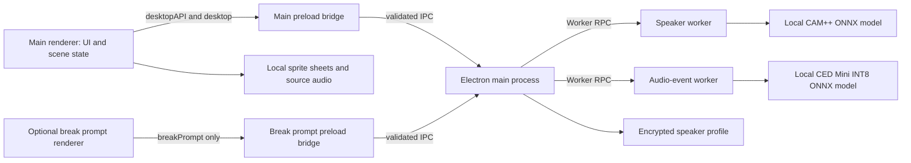
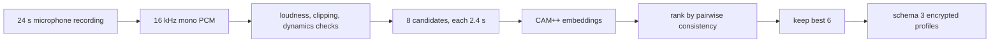
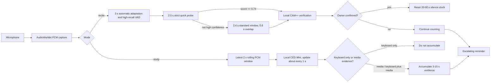

# 凛冬督学局架构

## 目标与边界

“凛冬督学局”是 Windows x64 本地安装 Electron 应用。背书模式在本机采集麦克风 PCM，先筛选疑似语音活动，再用本地声纹模型验证说话者；只有确认是登记用户时才重置静默计时。自习模式不使用声纹，改由本地 CED Mini 音频事件模型区分键盘与人声、音乐、电视/广播等媒体证据。

应用不使用摄像头、不保存原始录音、不上传声纹、PCM、音频事件标签或分类概率，也不依赖网络账号。当前方案不做活体或本人录音防重放。

## 进程与信任边界

- `main.js` 创建一个主 `BrowserWindow`，获得休息券或正在休息时最多再创建一个 420×220 提示窗；它还管理托盘、窗口模式、权限、`rwt://renderer` 协议、声纹服务和音频事件服务。
- `preload.js` 只向主页面暴露窗口、声纹、音频事件分类和休息提示控制；`break-prompt-preload.js` 只向休息提示页暴露两个提示动作。两个渲染器都没有 Node.js 权限。
- 所有 IPC 都同时核对具体窗口的 `webContents`、主 frame 与精确 `rwt://renderer` URL；两个窗口都拒绝 `window.open`、子 frame 导航和非预期主导航。
- `speaker-service.js` 串行化声纹操作，校验 profile，使用当前 Windows 用户的 DPAPI 加密并原子写入。
- `profile-crypto.js` 只通过隐藏的本地 PowerShell 子进程调用 Windows `ProtectedData`；声纹明文以 Base64 写入子进程标准输入，不出现在命令行、文件或日志中。
- `speaker-worker.js` 在线程中运行 Sherpa/CAM++，避免推理阻塞渲染与动画。
- `audio-event-service.js` 校验内存 PCM 和 RPC；`audio-event-worker.js` 在线程中运行 Sherpa/CED Mini。每次只返回有界的标签、索引与概率数组，不写入文件。
- `renderer/app.js` 持有双模式会话、VAD、声纹复核、休息流程、窗口模式与动画播放状态。
- `renderer/study-policy.js` 是阈值范围、有效学习时钟、休息/表扬里程碑、自习音频事件归类与累计判定的唯一事实源。

应用在模块加载后立即取得 Electron 单实例锁；第二次启动只让既有实例恢复完整场景。`app.whenReady()` 先注册协议、权限和 IPC，再同时启动两类模型初始化；主窗口和托盘在等待模型结果前创建，因此模型较慢时用户仍能看到明确的准备状态。正式包把 DevTools 关闭，并移除启动参数中的远程调试端口和管道；渲染器测试钩子只有在未打包源码且显式设置 `SUPERVISION_TEST_HOOKS=1` 时才会暴露，最终开关由主进程按 `app.isPackaged` 判定并通过绑定主窗口的 IPC 返回，启动参数不能自行开启。

主渲染进程异常退出时，主进程先取消仍在服务端登记的录入会话，清空提醒状态并销毁孤儿休息提示窗，再销毁并重建主窗口；持续无响应 10 秒也进入相同恢复流程。重建的是干净待命界面，不尝试从崩溃的渲染器复原会话内 PCM、学习计时或半完成录入。

## 声纹录入

- 唯一合法来源是 `mic`。
- 渲染器先检查 50 ms 能量帧的动态变化；Worker 再执行响度、削波和动态检查。
- 8 个候选按与其他候选的平均余弦相似度排序，保留前 6 个。
- 每个保留向量必须与其余 5 个向量的质心达到 0.50 一致性阈值。
- 档案保存模型哈希、维度、创建时间、阈值和 6 个嵌入，不保存 WAV、PCM 或其他原始录音。
- schema 不是 2 或 3、模型哈希/维度不符或文件损坏时 fail closed，并要求重新录入。schema 2 单份档案在内存中映射为“原有声纹”；只有新增或删除模板时才原子写入 schema 3。
- `beginEnrollment()` 为每次录入生成随机会话 ID；后续采样、完成和取消都必须携带当前 ID。渲染器在打开录入页后同样保存该 ID，并以 generation 使已经取消的采集回调失效。取消入口在准备、采集、推理和保存期间始终可用，隐藏、页面退出、轨道中断和渲染器恢复也会取消会话并停止麦克风。
- 完成录入时先更新 Worker、再加密并写入独占临时文件、同步到磁盘并原子替换；每个异步边界都重新检查会话 ID。取消或写入失败会把 Worker 和磁盘恢复到旧档案，回滚失败则停止声纹服务。删除模板同样先准备 Worker 状态，磁盘失败时回滚；可正常使用的档案只能按具体模板 ID 删除，无法使用的残留档案才允许走确认删除入口。

## 运行时检测与学习策略

- 背书启动后进行约 3 秒自动环境适应，再由高召回 `AdaptiveVad` 切出疑似语音窗口，最后交给 CAM++ 声纹验证；VAD 是候选分段器，不是本人判定器。自习完全不创建或使用 `AdaptiveVad`，麦克风打开后直接填充最近约 2 秒滚动分类窗口，首次有效分类约需 2 秒。
- 背书 VAD 的内部余量固定为 8 dB，既不持久化也不暴露为 UI 设置。自动适应阶段若疑似朗读帧占比达到保护条件，测得噪声基线会被保守钳制到不高于 -50 dBFS；这样最初约 3 秒被本人朗读污染时不会把朗读整体学成底噪，适应结束后的声学候选应在最多 300 ms 内恢复。
- 每份通过录入一致性检查的声纹模板保留独立质心；运行时取最佳模板分数，不把不同麦克风/环境模板再平均成全局质心。普通阈值为 0.55，强匹配阈值为 0.70。
- 连续疑似语音达到 2.0 秒时先做一次 0.74 严格快速确认。未通过只保持中性并保留 PCM；达到 2.4 秒后立即进入标准复核。快速推理期间新到的 PCM 继续缓存，推理完成后主动重新调度，避免恰好停声时丢失标准兜底。
- 强匹配一次即可确认；普通匹配要求最近三次判断中至少两次命中。
- 单次失败保持中性复核状态；连续三次明显失败才显示“暂未确认本人声音”。
- 确认状态保持 2.5 秒，验证间隔为 1.2 秒。
- 背书静默阈值由用户在 20～60 秒间选择；阈值到达时若存在正在采集/验证的候选，最多宽限 3 秒。
- 自习只向用户暴露 3～15 秒媒体持续时间，默认 8 秒；没有底噪、sensitivity 或音量 gate。CED Mini 最近约 2 秒滚动窗约每 1 秒更新；人声专用阈值为 0.12，音乐/通用媒体阈值为 0.20。媒体集合包含人声、音乐、电视、广播、游戏及爆炸、枪声、车辆、警报等常见媒体音效。单独键盘标签不累计；键盘占主导时仍保留“键盘 + 两项媒体证据”路径。
- 连续阳性先从原始证据时长中抵扣约 1 秒窗口重叠；三个 1 秒步进的阳性窗口只累计约 2 秒。应用把 `evidenceGapSeconds` 与 `rearmQuietSeconds` 都设为 5；候选中的孤立阴性窗口只进入恢复确认，不立即清零，连续正常达到 5 秒才同时清除原始/抵扣后累计并重新武装。5 秒内再次出现媒体证据时清除恢复计时并沿用原候选。
- 自习分类只允许 1 个实际 Worker 请求在途，并最多保留 2 个按采集顺序等待的窗口。每个作业带检测 generation；旧会话结果只能释放物理在途槽，不能写入新会话。第三个等待窗口出现时按检测无法跟上安全停止，而不是继续堆积、丢窗或乱序改写证据。
- 自习的 `getUserMedia` 约束请求关闭 `echoCancellation`、`noiseSuppression` 与 `autoGainControl`，避免系统优先消除电脑扬声器媒体声；浏览器、驱动或硬件可能不遵守，运行时需读取实际 track 设置并提示，不能把约束请求视为强保证。
- 普通无声巡查动画继续采集和判断；只有带源音轨的开场、结束、违规与表扬计划暂停检测和有效学习时钟，因此程序音轨不会被计为本人背书。暂停期间所有可见状态副本统一显示黄色“好好学！盯着你呢！”，只是正常动画状态，不表示违规或故障。
- 声纹单次推理的服务端截止时间为 4.5 秒，声音分类 Worker 为 5 秒；超时会终止对应 Worker、拒绝全部遗留请求并把服务标记为不可用。渲染器不会把这些失败送入违规状态机，而是停止预检或安全结束本次学习。
- 主麦克风会监听音频轨道的 `mute`/`ended`、`AudioContext` 状态、PCM 到达间隔和自习模式的全零采样。连续 5 秒收不到 PCM，或自习连续 10 秒只有数字零，都按检测链路失效安全停止；风扇或真正的环境安静仍会产生非零 PCM，不会因音量小直接走这条故障路径。
- 有效学习时钟、分类节流、候选宽限和运行时截止判断都使用 `performance.now()` 单调时钟，避免用户调整系统时间引起跳变。主进程在休眠与锁屏时通知渲染器取消录入与预检，并安全结束正在开始、学习或休息的会话；恢复与解锁事件会再次发送同一幂等中断通知，补偿系统在进入休眠/锁屏前未及时投递的情况。

### 待命检测测试

检测面板在会话开始前提供一个独立的 `preflight` 状态并复用正式 `getUserMedia(audio-only)`。背书测试走自动环境适应、高召回 VAD 与 CAM++ 声纹验证；自习测试直接走 CED Mini 滚动分类与 `QuietModeDetector`。自习首窗约 2 秒，形成前显示暖机状态，不把不完整窗口当成安静或违规。

`preflight` 始终保持 `active = false`，并把会话阶段归一为 `idle`。它不启动有效学习时钟、里程碑、巡查调度、动画、源音轨、提醒等级或学习记录。背书测试与正式会话共享最多 3 秒的候选采集宽限；一旦 CAM++ 已开始复核，提醒入口必须等待结果，不得把在途系统工作算成用户违规。声纹服务的 4.5 秒推理截止或渲染侧 5 秒外层保护任一触发，都按服务异常安全停止；最终达到当前阈值时只在检测面板显示“按当前设置将触发提醒”。背书模式没有本机声纹时拒绝启动测试并引导先录入，避免把普通 VAD 误展示成“本人检测”。

停止测试、开始学习、切换模式、打开声纹录入、手动预览动画、最小化/隐藏窗口、进入漂浮模式、麦克风轨道结束、页面退出或异常时都会走幂等清理，停止 `AudioWorklet`/轮询、关闭 `AudioContext` 并停止全部轨道。这样待命测试不会在后台悄悄占用麦克风，也不会与正式会话叠加第二条音频流。正式学习进入漂浮或完全隐藏时不会释放、重开或重置既有麦克风检测链路。

待命态的开始学习、动画预览、声纹录入与声纹删除使用同步置位的互斥状态。任何操作在第一次异步等待之前先占位并禁用其他入口，等待测试麦克风释放后再次核对状态；因此快速连点不会同时启动两个场景流程、两条麦克风流，或在启动途中修改声纹档案。

用户端不再存在白色门槛线、底噪/抗噪 range、漂浮窗底噪条或“重新校准环境底噪”。主界面的两条音量活动条只显示原始 RMS 作为输入反馈，不进入 CAM++ 终判、CED Mini 或 `QuietModeDetector`；漂浮布局完全不渲染音量条或检测参数。载入旧设置时忽略 `reciteSensitivityDb`，后续保存仅序列化当前设置，因此会移除该旧字段。

自习预检中改变持续时间会立即清除旧累计、解除 `QuietModeDetector` 的未武装状态、递增分类 generation 以丢弃在途旧结果，并清空旧滚动窗口，再等待约 2 秒首窗；正式自习中只更新持续时间，不清空已经形成的媒体证据。背书预检中改变 20～60 秒提醒时间可重置测试显示；正式背书中改变时间只更新界限，不重置已经累计的未确认时长或在途声纹候选。两个模式都没有灵敏度设置。

有效学习时钟只在 `studying` 阶段运行；休息、有声事件、开始/恢复、提醒和停止阶段全部暂停。里程碑规则为：

| 模式 | 休息券 | 表扬 |
|---|---|---|
| 背书 | 每 20 分钟 1 张，每张 2 分钟 | 每 45 分钟 |
| 自习 | 每 45 分钟 1 张，每张 2 分钟 | 每 60 分钟 |

休息券在当前会话内累计。休息时释放麦克风并隐藏主窗口；倒计时结束后恢复主窗口，播放一次有声 `E1 → S1 → X1` 并重新打开麦克风。背书随后自动适应环境约 3 秒再回到检测；自习直接回到 `studying` 并重新形成约 2 秒首窗。

## 场景状态机

`renderer/scene-rules.js` 生成计划，`renderer/app.js` 负责调度和播放。

| 计划 | 顺序 | 自动音轨 |
|---|---|---|
| 开场 | `E1 → S1 → X1` | 三段各自源音轨 |
| 普通巡查 | 随机入场 → 正常观察 → 随机退场 | 静音 |
| 独立事件 | `L_lean` / 红或蓝路过 | 静音 |
| 里程碑表扬 | 随机入场 → `R_pass_react_salute` → 随机退场 | 三段各自源音轨 |
| 第一次违规 | 随机入场 → `R1_react_yell` → 随机退场 | 三段各自源音轨 |
| 第二次违规 | 随机入场 → `R_aim_react_gun` → 随机退场 | 三段各自源音轨 |
| 第三次违规 | 随机入场 → `R_aim_shoot` 或 `R_whip_react_lash` | 两段各自源音轨；结束会话 |
| 手动结束 | `E1 → R_pass_react_salute → X1` | 三段各自源音轨 |

正常计划每 30～120 秒调度一次，25% 为独立事件，75% 为完整巡查。待播放的表扬优先于随机计划。窗口隐藏时普通计划不会恢复窗口；里程碑表扬会临时恢复同一个完整主窗口，播放字幕与源音轨后回到原后台方式；违规会恢复同一个主窗口并置顶。

`R_fatigue_warning` 与 `X6_exit_abrupt` 不在自动池，只能在媒体库中手动预览。

## 无黑屏媒体播放

- 媒体清单固定为 22 段，均含 1280×720、24 FPS 精灵图和对应源音轨。
- `media-player.js` 在播放下一段前并行预解码图集和可选音频。
- 切换时保留上一段末帧，不调用 Canvas `clearRect`，也不改变画布尺寸。
- 1920×1080 是展示目标；源帧只做等比例缩放。
- 媒体 manifest 中的哈希用于完整性校验，不代表版权授权。

## 窗口模型

主窗口模式为：

- `scene`：正常可见场景。
- `hidden`：同一窗口隐藏到托盘，检测继续。
- `floating`：同一窗口默认/最大 320×225、最小 224×170，可缩放、置顶并跳过任务栏；上方 44 像素常驻镜像统一检测结果，下方继续显示同一 Canvas 的 16:9 动画。正常和未达阈值状态不另设计时；只有红色异常判断在原句中附带累计秒数。状态、计时和动画区域是原生拖动区；鼠标移入时才在动画上方出现“已学习”有效计时、“隐藏”和“放大”，其中“隐藏”进入完全后台，不覆盖常驻状态。悬停操作层是 `body` 下的顶层固定元素，不嵌套在 44 像素拖动状态栏中，并对容器和按钮显式使用 `no-drag`；否则 Electron 的原生拖动命中会在 DOM 看似可点击时吞掉真实鼠标点击。取消漂浮窗双击放大，只保留明确的“放大”按钮。
- `alert`：发生违规时恢复同一窗口并置顶。

后台偏好为 `hidden | floating`，默认 `hidden`。正式学习时，“隐藏到后台”主按钮在悬停或键盘聚焦后可直接选择两种方式，检测面板保留同一设置；标题栏关闭键遵循已保存选择。待命检测测试转入任一后台方式都会停止并释放测试麦克风。漂浮模式不创建额外 `BrowserWindow`、不重新载入页面，也不替换 `webContents`、Canvas、动画播放器或检测状态。

窗口模式操作由主进程串行化。完整场景、漂浮窗或提醒之间切换时，先锁定当前显示器，再隐藏原窗口并完成原生尺寸/置顶/任务栏属性，最后通知渲染器切换布局；渲染器优先在连续两个动画帧后回传带递增编号的严格回执，隐藏页面无法产生动画帧时则在 80 毫秒内强制完成布局并回执，主进程收到匹配回执后才显示窗口。最终超时会保持主窗口隐藏，不暴露尺寸与布局不匹配的残缺界面。这样不会让全尺寸窗口短暂显示漂浮布局，也不会让漂浮尺寸窗口短暂显示完整布局。重复请求当前可见模式直接聚焦或保持原位，不重新隐藏/重排。普通恢复、最小化和最大化请求不能中断正在播放的提醒；只有异常清理使用独立的强制恢复 IPC。

漂浮窗的 `will-move` 只标记一次手动移动，`moved` 再读取 Windows 原生拖动完成后的最终 bounds；移动链路不调用 `preventDefault()` 或 `setBounds()`，因此不会用旧宽高覆盖用户刚调整的尺寸。缩放链路也不监听或拦截 `will-resize`：进入漂浮模式时设置 Windows 原生最小/最大尺寸，`resize` 只记录系统最终 bounds，`resized` 再串行保存宽高。只有重新显示、切屏或避让休息提示时才把位置校正回当前工作区。位置只在当前进程保留，不写入偏好文件；快速连续选择后台方式时仍以最后一次操作为准。

主进程在进入 `alert` 时保存来源模式并签发递增提醒编号；渲染器只能携带该编号请求“返回原状态”或“强制回完整场景”，不能指定任意目标模式。过期编号、非法枚举和额外字段被拒绝或忽略。非致命提醒遵循 `scene → scene`、`hidden → hidden`、`floating → floating`，致命提醒、手动结束与异常清理回到 `scene`。

窗口关闭按钮等同于进入后台；托盘“退出程序”才结束主进程。退出前主进程最多等待 2.5 秒，让后台方式、学习设置和窗口切换串行链完成；渲染器在用户修改设置时立即把写入请求交给主进程，避免退出时仍有尚未发送的渲染器队列。休息提示窗是严格单例、无边框、跳过任务栏且不抢焦点；可选择立即休息或攒下。没有提示时 `BrowserWindow` 数量为 1，提示存在时为 2。漂浮窗与右下角休息提示共存时先移到提示上方，空间不足再移到左下角，提示关闭后恢复原漂浮位置。违规始终复用主窗口；违规提醒展开前暂时隐藏休息提示，提醒结束后若提示仍有效再恢复，防止其置顶遮挡督学画面。

主窗口使用自定义标题栏：右上角标准顺序为最小化、最大化/还原、隐藏到后台；标题栏其余区域使用 Electron 的拖动区域移动窗口，双击可切换最大化/还原。渲染器只通过受信任 IPC 请求窗口动作。主窗口原生最小尺寸为 960×540，可以继续放大或调整比例，但 Canvas 始终按 16:9 等比例绘制。

核心会话阶段为 `idle → starting → studying → resting → resuming`，违规临时进入 `violation`，结束进入 `stopping`。待命检测测试是 `idle` 内部的非会话子状态，不进入这条有效学习状态机。动画解码或窗口 IPC 失败时统一进入幂等失败清理：停止有效时钟和媒体、释放麦克风、清除遮罩/展示状态、关闭休息提示并尽力恢复主窗口，最后回到 `idle`。

## 数据位置

数据根仍为 `%APPDATA%/背书自习监督`；这是升级兼容所需的稳定旧根，可见产品名改为“凛冬督学局”后也不迁移或改名，以免既有声纹丢失或要求用户重复录入。自动化测试可通过 `SUPERVISION_DATA_DIR` 指向隔离目录。

- `speaker-profile.dat`：Windows DPAPI（当前 Windows 用户）加密的声纹特征，是唯一由本应用持久保存的音频派生数据；schema 3 最多保存 5 份同一用户的模板。读取前要求它是 1 字节～4 MiB 的普通文件；空文件、目录、超限、损坏或无法由当前用户解密的档案均 fail closed，不送入 Worker。无效档案可在用户确认后删除；有效档案不能伪装成“残留文件”绕过模板选择。DPAPI 子进程最长运行 10 秒，标准输出最多 4 MiB，并通过一次实际加密—解密往返确认可用。
- `study-preferences.json`：除固定 `schemaVersion` 外，只保存 `{ mode, reciteSilenceSeconds, studyVoiceSeconds, microphoneDeviceId, microphoneDeviceLabel }`。两个时间分别限制在 20～60 秒和 3～15 秒；设备标识和标签仅用于让测试、正式学习与声纹录入共用用户明确选择的麦克风，不含音频、声纹、检测结果、学习记录或计时。读取前以 `lstat` 要求它是不超过 64 KiB 的非空普通文件；不符合时使用安全默认值。已选设备缺失时保留原 ID 与标签并显示不可用，绝不按同名设备或系统默认设备自动替换。
- `window-preferences.json`：只保存 `{ backgroundMode, floatingWindowSize }`，使用临时文件加替换的原子写入；不保存窗口位置、窗口内文字、学习时长、检测结果、音频、声纹或个人信息。读取同样只接受不超过 64 KiB 的非空普通文件；损坏/非法模式安全回退为 `hidden`，非法尺寸钳制到 224×170～320×225。
- 背书的 8 dB VAD 余量是代码内常量，不进入声纹档案、窗口偏好或渲染设置；旧渲染设置中的 `reciteSensitivityDb` 只迁移删除，不参与运行时判断。
- 自习模式的原始 PCM、CED Mini 标签和概率只在 `AudioWorklet → IPC → audio-event-worker` 的有界内存链路中流转，不进入档案、设置、日志、浏览器缓存或学习记录；分类完成或会话释放后丢弃。
- 主场景和休息提示共享 `rwt-runtime` 非持久会话，并以 `cache: false` 创建；两个窗口的 V8 代码缓存也被禁用。因此该会话的 `storagePath` 为 `null`，不会写出 `SessionData/`、`Code Cache/`、`GPUCache/` 等 Chromium 浏览器缓存。
- Electron 默认会话的必要临时目录位于数据根内的 `TransientElectronData/run-<pid>/`。每次启动会清理已退出进程留下的运行目录；正常 `will-quit` 时还会启动一个最小 Node 清理器，待主进程退出后删除本次运行目录。清理目标必须是该根下名称精确匹配 `run-<pid>` 的绝对路径；如果目标或旧条目是符号链接/目录联接，只解除链接本身，绝不递归跟随到外部目标。该目录不是用户数据，不能与 `speaker-profile.dat` 一起保留或发布。
- 首次安装不会自动接触旧便携版的 `RedWatchReciteData`；如需继续使用背书模式，用户在新安装版中重新录入声纹。

任何测试和构建都必须避免覆盖真实用户数据。
